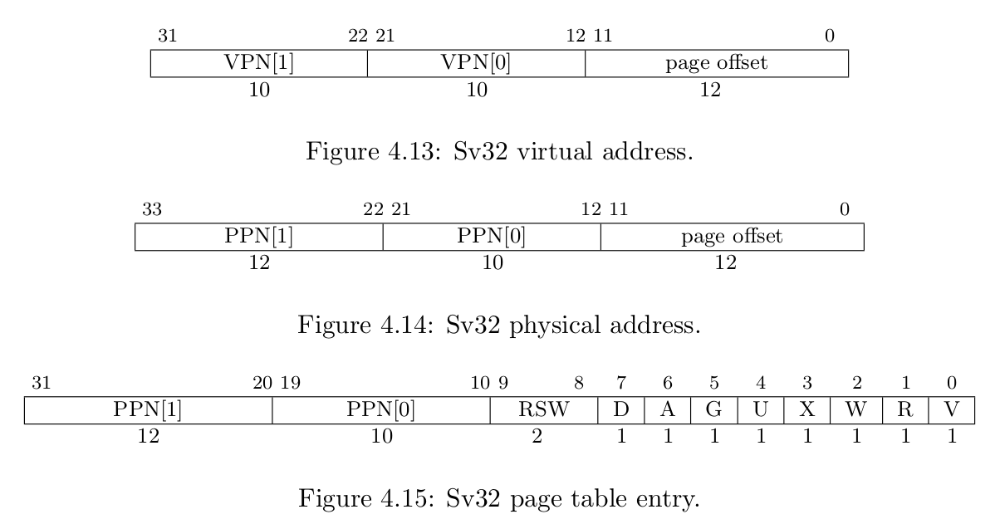
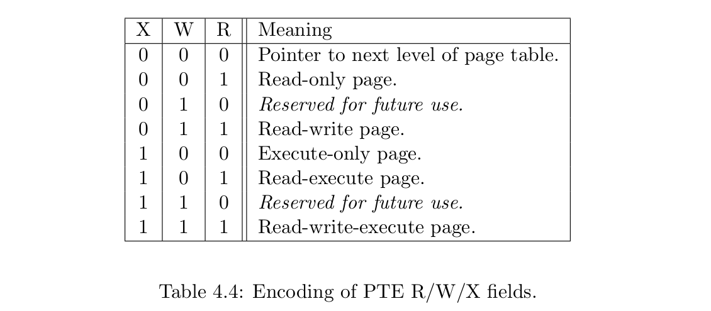

## RISC-V Linux Page Table I

The RISC-V page table formats can be found in [`RISC-V Privileged ISA Specification`](https://riscv.org/specifications/privileged-isa/). Current RISC-V (**Document Version 20190608-Priv-MSU-Ratified**) supports three types of virtual memory, Sv32 for RV32, Sv39 and Sv48 for RV64, which supports 32-bit, 39-bit and 48-bit virtual address space respectively.

### Sv32 Implementation

The page table format of Sv32 is as above[^note1]. The page size of Sv32 is 4 KiB, which is a popular page size. Thus,  It has a 12-bit long page offset. With each page table entry being 4 bytes, each page table contains 1024 page table entries. Therefore, the higher 20 bits of virtual address (virtual page number) is divide into two parts, VPN[0] and VPN[1], 10 bits each. The 20 bits virtual page number is translated into 22-bit physical page number via a two-level page table. You may wonder why physical page number is 2-bit longer than virtual page number. This is because the highest two bits are used by Physical Memory Protection (**PMP**). I will not introduce PMP here. And you may read the privileged ISA specification for details. In addition, Sv32 also supports 4 MiB megapages.

The lower 10 bits of a page table entry encode the ***protection bits*** of this page. The meaning of each bit is as follows:

-  V: This bit determines if the remaining bits are valid. When V = 0, any virtual address translation operation that traverses to this page table entry will result in a page fault.
- R: This bit determines whether this page is readable, readable when R = 1.
- W: This bit determines whether this page is writable, writable when W = 1.
- X: This bit determines whether this page is executable, executable when X = 1.
- U: This bit determines whether this page belongs to user. If U = 0, U mode cannot access this page. If U = 1, U mode can access this page and S mode can access this page only when ***SUM bit*** in the sstatus register is set. And this bit must be cleared for non-leaf PTEs.
- G: This bit indicates whether this mapping is valid for all virtual address spaces, and the hardware can use this information to improve the performance of address translation. Generally, this bit is only used for pages belonging to the operating system.
- A: Accessed bit, must be cleared for non-leaf PTEs.
- D: Dirty bit, must be cleared for non-leaf PTEs.
- RSW: These two bits is reserved for operating system and will be ignored by hardware.

Besides, different combinations of R, W and X bits also have special meanings.

### Sv39 Implementation

And the other design of Sv39 follows the overall scheme of Sv32. 

### Reference

[^note1]:https://riscv.org/specifications/privileged-isa/)https://riscv.org/specifications/privileged-isa/